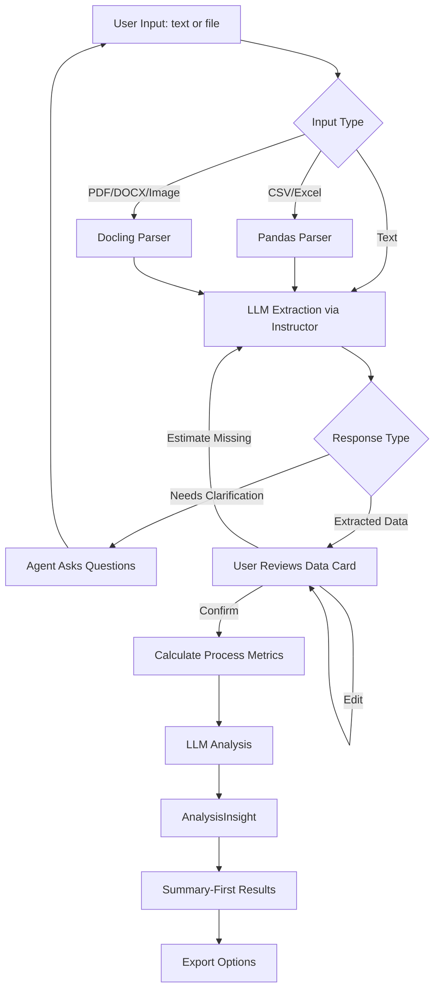
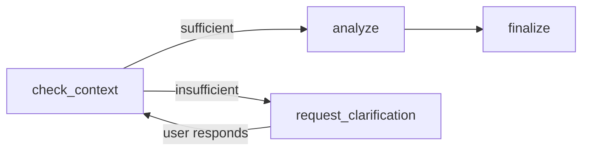

# ProcessIQ

AI-powered process optimization advisor that understands business context — not just data.


---

## Overview

ProcessIQ is a high-CQ (Context Quotient) AI agent that analyzes business processes, identifies genuine bottlenecks, and generates constraint-aware recommendations with assumption-driven ROI estimates.

Unlike generic LLM tools, ProcessIQ:

- Distinguishes waste from core value work
- Respects real-world constraints (budget, hiring freezes, regulation)
- Makes confidence-driven decisions, asking for clarification when it needs more data
- Explains assumptions transparently — no false precision
- Calibrates recommendations to business size (a bakery gets different advice than an enterprise)

---

## Demo

> **Screenshot placeholder — add a screen recording or GIF of the chat interface here**
>
> Suggested flow to record:
> 1. Describe a process in plain text (e.g. "Our invoice approval takes 3 days...")
> 2. Agent extracts structured steps and shows the data card
> 3. Click "Confirm & Analyze"
> 4. Walk through the results: summary, bottleneck, recommendation with progressive disclosure

```
<!-- Replace this block with your screenshot or GIF -->
<!-- Example:

-->
```

---

## Problem Statement

Most process optimization tools either:

- Require structured event logs (enterprise systems)
- Provide generic LLM suggestions with no constraint awareness
- Ignore operational reality (budget, headcount, regulations)
- Present unrealistic ROI precision

ProcessIQ bridges this gap by combining deterministic metric calculation with structured LLM judgment inside a stateful agent architecture.

---

## Why an Agent?

If a system must make judgment calls rather than execute a fixed sequence of steps, an agent architecture is justified.

ProcessIQ requires agentic behavior because it must:

1. Evaluate whether sufficient context exists before proceeding
2. Decide when to ask clarifying questions instead of guessing
3. Interpret patterns beyond deterministic metrics (waste vs. core value)
4. Resolve constraint conflicts (cannot hire + hire 2 people = contradiction)
5. Branch based on confidence scores

### Agent Type: Utility-Based Agent

ProcessIQ optimizes competing objectives:

- Cost vs. time vs. quality
- Regulatory constraints
- User-defined priorities

It evaluates utility (ROI weighted by confidence and constraints) and generates recommendations that maximize value under realistic conditions.

---

## Core Design Principle

**Algorithms calculate facts. The LLM makes judgments.**

| Component | Source | Deterministic |
|-----------|--------|---------------|
| Process metrics (% of total time, cycle time) | Algorithm | Yes |
| ROI calculations (pessimistic/likely/optimistic) | Algorithm | Yes |
| Confidence scoring (data completeness) | Algorithm | Yes |
| Waste vs. core value assessment | LLM | No |
| Root cause reasoning | LLM | No |
| Recommendation generation | LLM | No |

This separation ensures transparency, auditability, and reliability.

---

## Architecture

### High-Level Flow



### LangGraph Agent (4 Nodes)



| Node | Responsibility |
|------|----------------|
| `check_context` | Evaluate data completeness, decide whether to proceed or ask |
| `request_clarification` | Ask targeted follow-up questions based on data gaps |
| `analyze` | Calculate process metrics + LLM pattern analysis |
| `finalize` | Package structured `AnalysisInsight` into final response |

---

## Context Quotient (CQ)

Agent effectiveness: **Performance = IQ × EQ × CQ**

High-CQ means recommendations adapt to the user's specific business reality.

| Generic Agent | ProcessIQ |
|---------------|-----------|
| "This step is slow" | "This step is slow and blocks 3 downstream tasks" |
| "Automate this" | "Automate this — but given your no-hiring constraint, here's a software-only option" |
| "ROI: $50K" | "ROI: $30K–$70K, confidence 62% — missing error rate data for steps 3–5" |

---

## Features

### Chat-First Interface
- Describe processes in plain language or upload files
- Smart interviewer: extracts structured data OR asks clarifying questions — never guesses
- Inline editable data table after extraction
- Draft analysis preview before full confirmation
- Post-analysis follow-up conversation with full context

### Data Ingestion
- 14 supported file formats via Docling (PDF, DOCX, PPTX, Excel, HTML, PNG, JPG, TIFF, BMP)
- LLM-powered normalization via Instructor + Pydantic — handles messy, inconsistent data
- Files processed in-memory only, never stored on disk

### Analysis Engine
- Process metrics: cycle time, bottleneck identification, dependency graph
- Waste vs. core value differentiation (LLM judgment, not just "longest = worst")
- Root cause analysis with explicit reasoning
- ROI ranges: pessimistic / likely / optimistic with stated assumptions
- Confidence scoring based on data completeness

### Results Display
- Summary-first layout: key insight → main opportunities → core value work
- Issues linked directly to recommendations
- Progressive disclosure: summary → plain explanation → concrete next steps
- Estimated values marked with `*` to distinguish from user-provided data

### Flexibility
- OpenAI / Anthropic / Ollama (local) LLM support
- Per-task model configuration (fast model for extraction, stronger for analysis)
- Analysis mode presets: Cost-Optimized / Balanced / Deep Analysis
- Export: CSV (Jira-compatible), text summary, markdown report

---

## Privacy

- Uploaded files processed in-memory — never written to disk
- Session data in local SQLite (browser-session scoped)
- No persistent document storage
- No training on user data
- Self-hosted LLM option via Ollama for sensitive environments

---

## Project Structure

```
processiq/
├── app.py                     # Streamlit entry point
├── src/processiq/
│   ├── config.py              # pydantic-settings configuration
│   ├── constants.py
│   ├── exceptions.py          # Custom exception hierarchy
│   ├── llm.py                 # LLM factory (Anthropic/OpenAI/Ollama)
│   ├── logging_config.py
│   ├── model_presets.py       # Analysis mode presets
│   │
│   ├── agent/                 # LangGraph agent
│   │   ├── state.py           # AgentState (TypedDict)
│   │   ├── nodes.py           # 4 node functions
│   │   ├── edges.py           # Conditional routing
│   │   ├── graph.py           # Graph construction
│   │   ├── interface.py       # Clean API for UI layer
│   │   └── context.py         # Conversation context builder
│   │
│   ├── analysis/              # Pure algorithms (no LLM)
│   │   ├── metrics.py         # Process metrics calculation
│   │   ├── roi.py             # ROI with PERT-style ranges
│   │   └── confidence.py      # Data completeness scoring
│   │
│   ├── ingestion/
│   │   ├── csv_loader.py
│   │   ├── excel_loader.py
│   │   ├── normalizer.py      # LLM extraction via Instructor
│   │   └── docling_parser.py  # Universal document parsing
│   │
│   ├── models/                # Pydantic domain models
│   │   ├── process.py         # ProcessStep, ProcessData
│   │   ├── constraints.py     # Constraints, Priority
│   │   ├── insight.py         # AnalysisInsight, Issue, Recommendation
│   │   └── memory.py          # BusinessProfile (memory-ready)
│   │
│   ├── persistence/
│   │   ├── checkpointer.py    # LangGraph SqliteSaver wrapper
│   │   └── user_store.py      # UUID-based session identity
│   │
│   ├── prompts/               # Jinja2 prompt templates
│   │   ├── system.j2
│   │   ├── extraction.j2
│   │   ├── analyze.j2
│   │   ├── clarification.j2
│   │   ├── followup.j2
│   │   └── improvement_suggestions.j2
│   │
│   ├── export/
│   │   ├── csv_export.py      # Jira-compatible CSV
│   │   └── summary.py         # Text and markdown reports
│   │
│   └── ui/
│       ├── state.py           # Session state management
│       ├── views.py           # Render functions
│       ├── handlers.py        # Input handlers
│       ├── styles.py          # CSS
│       └── components/        # Streamlit UI components
│
├── tests/
│   ├── unit/
│   └── integration/
│
└── data/                      # Sample data for testing
    ├── sample_process.csv
    ├── sample_constraints.json
    └── sample_messy.xlsx
```

---

## Technology Stack

| Layer | Technology | Purpose |
|-------|-----------|---------|
| Agent orchestration | LangGraph | Stateful graph with conditional branching |
| LLM providers | OpenAI / Anthropic / Ollama | Analysis, extraction, clarification |
| Structured output | Instructor + Pydantic | Validated LLM responses, auto-retry on failure |
| Document parsing | Docling | PDF, DOCX, Excel, images (14 formats) |
| UI | Streamlit | Chat-first interface |
| Configuration | pydantic-settings | Type-safe `.env` config |
| Prompt templating | Jinja2 | Separate `.j2` files, no inline strings |
| Observability | LangSmith | Agent traces, token usage, node timing |
| Session persistence | LangGraph SqliteSaver | Conversation checkpointing |

---

## Quick Start

```bash
git clone https://github.com/SkybrushThriftwood/processIQ.git
cd processiq
uv sync --group dev
cp .env.example .env
# Edit .env — add your OPENAI_API_KEY or ANTHROPIC_API_KEY
uv run streamlit run app.py
```

---

## Development

```bash
# Run tests
uv run pytest

# Run only non-LLM tests (fast, no API calls)
uv run pytest -m "not llm"

# Lint
uv run ruff check src/

# Type check
uv run mypy src/
```

---

## Roadmap (Phase 2)

- ChromaDB integration for RAG (document embedding and retrieval)
- Persistent memory across sessions (episodic + semantic)
- Feedback-driven learning (accepted/rejected suggestions inform future recommendations)
- LLM response streaming
- Interactive process visualization
- Multi-user collaboration

---

## Limitations

- ROI estimates are assumption-driven, not actuarial
- LLM reasoning quality depends on input completeness
- Not a replacement for professional process consulting

---

## Differentiation

| Enterprise Process Mining | ProcessIQ |
|---------------------------|-----------|
| Requires structured event logs | Works from plain text, files, or any format |
| $100K+ licensing | Open-source |
| Black-box analytics | Transparent assumptions and reasoning |

| Generic LLM Chat | ProcessIQ |
|------------------|-----------|
| Unstructured text output | Validated Pydantic models |
| Generic advice | Constraint-aware, business-calibrated recommendations |
| No confidence tracking | Confidence-driven branching |
| Stateless | Stateful agent with conversation history |

---

## License

MIT
