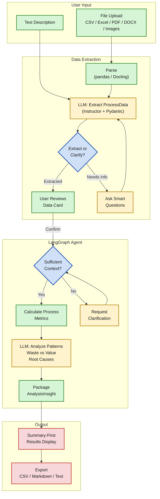

# ProcessIQ

AI-powered process optimization advisor that analyzes business processes, identifies inefficiencies, and provides actionable recommendations with ROI estimates.

ProcessIQ is a high-CQ (Context Quotient) agent — it understands your business constraints, industry context, and process nuances to provide recommendations that work in your specific situation, not generic advice.

## What It Does

Describe a business process in plain text or upload a file, and ProcessIQ will:

- **Extract** structured process data from natural language or documents (PDF, Excel, Word, images)
- **Analyze** the process to identify genuine bottlenecks, wasteful patterns, and root causes
- **Distinguish** between waste and core value work (a 4-hour creative task is not a bottleneck)
- **Recommend** specific improvements with trade-offs, feasibility, and expected benefits
- **Calculate** ROI estimates with explicit assumptions and confidence ranges

## Architecture



**Core principle:** Algorithms calculate facts (metrics, percentages, dependencies). The LLM makes judgments (is this waste or value? what patterns are unusual?).

## Quick Start

### Prerequisites

- Python 3.12+
- [uv](https://docs.astral.sh/uv/) (Python package manager)
- API key for OpenAI or Anthropic

### Setup

```bash
# Clone the repository
git clone https://github.com/yourusername/processiq.git
cd processiq

# Install dependencies
uv sync --group dev

# Copy environment template and add your API keys
cp .env.example .env
# Edit .env with your API keys
```

### Run

```bash
uv run streamlit run app.py
```

The app opens at `http://localhost:8501`.

## Configuration

Copy `.env.example` to `.env` and configure:

```bash
# Required: at least one LLM provider
OPENAI_API_KEY=your-key-here
ANTHROPIC_API_KEY=your-key-here      # Optional

# LLM Settings
LLM_PROVIDER=openai                   # openai, anthropic, or ollama
LLM_MODEL=                            # Empty = provider default
LLM_TEMPERATURE=0.0

# Optional: LangSmith observability
LANGSMITH_API_KEY=your-key-here
LANGSMITH_TRACING=true
```

### Analysis Mode Presets

The sidebar offers three presets that configure per-task model selection:

| Mode | Description | Best For |
|------|-------------|----------|
| Cost-Optimized | Fast models everywhere | Testing, iteration |
| **Balanced** (default) | Fast extraction, thorough analysis | Most users |
| Deep Analysis | Best models everywhere | Important decisions |

## Project Structure

```
src/processiq/
    config.py              # pydantic-settings configuration
    llm.py                 # Centralized LLM factory (OpenAI/Anthropic/Ollama)
    model_presets.py       # Analysis mode presets

    models/                # Pydantic domain models
        process.py         # ProcessStep, ProcessData
        insight.py         # AnalysisInsight, Issue, Recommendation
        constraints.py     # Constraints, Priority
        memory.py          # BusinessProfile

    analysis/              # Pure algorithms (no LLM)
        metrics.py         # Process metrics for LLM consumption
        roi.py             # ROI calculations
        confidence.py      # Data completeness scoring

    agent/                 # LangGraph agent
        graph.py           # Graph: check_context -> analyze -> finalize
        nodes.py           # Node functions
        interface.py       # Clean API for UI

    ingestion/             # Data loading
        normalizer.py      # LLM extraction with Instructor
        docling_parser.py  # Universal doc parsing (14 formats)
        csv_loader.py      # CSV/Excel parsing

    prompts/               # Jinja2 prompt templates
        extraction.j2      # Process extraction + interview
        analyze.j2         # LLM-based analysis
        system.j2          # Base system prompt

    persistence/           # Session persistence
        checkpointer.py    # LangGraph SqliteSaver

    ui/                    # Streamlit frontend
        views.py           # Render functions
        handlers.py        # Input handlers
        components/        # Chat, expert panel, results display, etc.
```

## Tech Stack

| Component | Technology | Purpose |
|-----------|------------|---------|
| Agent orchestration | **LangGraph** | Stateful graph with conditional branching |
| LLM providers | **OpenAI / Anthropic / Ollama** | Flexible model selection |
| Structured output | **Instructor** | Pydantic-validated LLM responses with auto-retry |
| Document parsing | **Docling** | PDF, DOCX, Excel, images (14 formats) |
| Data models | **Pydantic** | Validation, serialization |
| Configuration | **pydantic-settings** | Type-safe config with .env loading |
| UI | **Streamlit** | Chat-first interface |
| Prompt templates | **Jinja2** | Maintainable prompt management |
| Observability | **LangSmith** | Trace agent execution |
| Persistence | **SQLite** (via LangGraph) | Session checkpointing |

## Documentation

- [Project Brief](docs/PROJECT_BRIEF.md) — Architecture, design rationale, and technical specification
- [Conversation Flow](docs/CONVERSATION_FLOW.md) — Chat UI states, message types, and agent behavior
- [Changelog](CHANGELOG.md) — Design decisions and code changes

## Development

```bash
# Run tests
uv run pytest

# Lint and format
uv run ruff check src/
uv run ruff format src/

# Type checking
uv run mypy src/
```

## License

MIT
