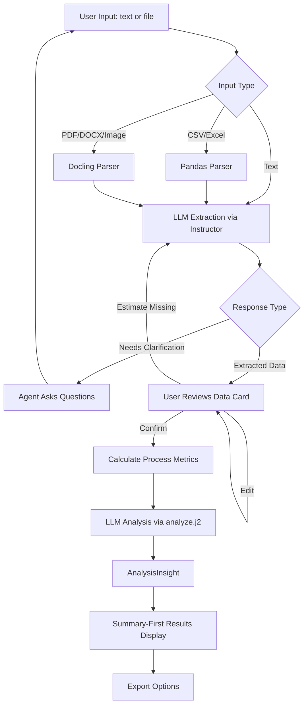
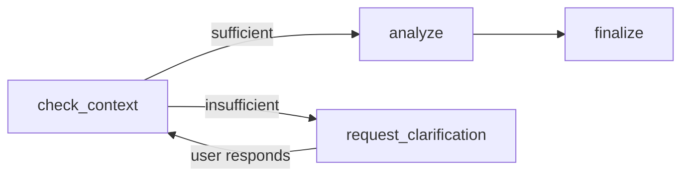
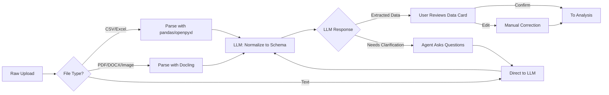

# ProcessIQ - Project Brief

## Overview

AI-powered process optimization advisor that analyzes business processes, identifies bottlenecks, and provides assumption-driven ROI estimates.

**Core Value Proposition:** ProcessIQ is a high-CQ (Context Quotient) agent—it doesn't just analyze processes, it understands *your* business constraints, precedents, and decision context to provide recommendations that actually work in your specific situation.

---

## Revision History

### 2026-02-05: LLM-First Analysis Rework

**Change:** Replaced algorithm-first analysis with LLM-first analysis pipeline.

**Problem:** The original architecture used algorithms to find bottlenecks (just `max(time)`) and the LLM only formatted the output. This produced obvious results ("your longest step is the bottleneck") and absurd suggestions ("automate creative work").

**Solution:** Algorithms calculate FACTS (percentages, dependencies, metrics), LLM makes JUDGMENTS (is this waste or core value? what patterns are unusual?).

**Impact:**
- New `analysis/metrics.py` for process metric calculation
- New `models/insight.py` with `AnalysisInsight`, `Issue`, `Recommendation` models
- New `analyze.j2` prompt for LLM-based pattern analysis
- Agent graph simplified from 8 nodes to 4 nodes
- Summary-first results display (leads with insight, not data tables)
- Deleted `analysis/bottleneck.py` and 6 unused prompt templates
- Full rework plan in `docs/private/REWORK_PLAN.md`

### 2026-02-03: UI Paradigm Shift

**Change:** Pivoted from form-based input to chat-first interface with file drop.

**Reason:** Form-heavy UI created significant friction for non-technical users. Modern user expectation is conversational AI + drag-and-drop, not structured data entry.

**Impact:**
- Chat-first interface becomes primary interaction mode
- Forms become "edit mode" for reviewing/correcting extracted data
- Session persistence via LangGraph SqliteSaver
- Docling integration for universal document parsing (PDF, DOCX, Excel, images)
- UI decoupled from agent via `agent/interface.py`

---

## Why an Agent? (Not Over-Engineering)

> "When not to use agents - Anthropic strongly emphasizes restraint. Many problems are solved with a single well-designed prompt, retrieval (RAG), or in-context examples. Agents trade latency, cost, and control for flexibility. Only escalate complexity when simpler solutions clearly fail."

### What a Simple Pipeline Could Do

| Task | Pipeline Sufficient? |
|------|---------------------|
| Parse CSV data | Yes |
| Find max cycle time step | Yes |
| Generate single explanation | Yes |
| Calculate ROI formula | Yes |

### Why ProcessIQ Requires an Agent

ProcessIQ needs a **graph with conditional branching based on reasoning**:

```
                    AGENTIC DECISION POINTS

  1. CONTEXT SUFFICIENCY CHECK
     Agent sees data -> decides: "Do I have enough context?"
     -> If NO: Ask clarifying questions (loop back)
     -> If YES: Proceed to analysis

  2. PATTERN ANALYSIS (LLM JUDGMENT)
     Agent examines process metrics and decides:
     -> Which steps are waste vs core value?
     -> What patterns are unusual for this type of process?
     -> What root causes are likely?

  3. CONSTRAINT-AWARE RECOMMENDATIONS
     Agent proposes solutions that respect constraints:
     -> "hire 2 people" but constraint = no hiring
     -> Must pivot to alternative approaches
     -> Trade-offs made explicit

  4. CONFIDENCE-DRIVEN BRANCHING
     After analysis, confidence = 45%
     -> Agent decides: "I should ask for missing data"
     -> OR: "Confidence is acceptable, proceed"
```

**The Litmus Test:** If the system must make *judgment calls* (not just execute steps), an agent is justified.

ProcessIQ passes this test because:
- Multiple valid analysis paths exist
- Constraints can conflict (budget vs timeline vs quality)
- Confidence levels trigger different behaviors
- User context may require clarification loops

---

## Agent Architecture Classification

### Type: Utility-Based Agent

ProcessIQ fits the **Utility-Based Agent** pattern:

| Characteristic | ProcessIQ Implementation |
|----------------|--------------------------|
| Multiple competing objectives | Cost vs time vs quality vs constraints |
| Utility function | ROI calculation with confidence weighting |
| Tradeoff handling | Constraint conflict resolution node |
| State tracking | Maintains context, findings, confidence scores |

Unlike simpler agent types (reflex, goal-based), ProcessIQ must calculate which suggestions maximize overall value given competing constraints—not just achieve a single goal.

### Evolution Path: Learning Agent (Phase 2)

Phase 2 adds Learning Agent characteristics:

| Component | Implementation |
|-----------|----------------|
| **Critic** | User accepts/rejects suggestions with reasons |
| **Learning element** | Patterns extracted from rejection reasons |
| **Adaptation** | Recommendation style adjusts to user preferences |

### Pattern Mapping

| ProcessIQ Feature | Agent Pattern |
|-------------------|---------------|
| Clarification loop | Human-in-the-Loop (uncertainty -> human review) |
| Confidence < 60% triggers questions | Model-Based (internal state tracking) |
| Constraint validation before suggestions | Guardrails pattern |
| Memory-ready design | ABC Framework (Acquire -> Build -> Connect) |

---

## Context Quotient (CQ) Design Principles

> Agent success = IQ x EQ x CQ (multiplicative, not additive)

### What High-CQ Means for ProcessIQ

| Generic Agent | High-CQ ProcessIQ |
|--------------|-------------------|
| "This step is slow" | "This step is slow *and* blocks 3 downstream steps *and* violates your no-hiring constraint" |
| "Automate this" | "Automate this—but you rejected similar suggestions before because of compliance. Here's why this is different." |
| "ROI: $50K" | "ROI: $50K, but confidence is low because we're missing error rate data for steps 3-5" |

### CQ Implementation (Phase 1)

- **Explicit constraint tracking** (budget, headcount, regulations)
- **Assumption transparency** (every estimate shows its assumptions)
- **Confidence scoring** (not false precision)
- **Context-aware suggestions** (validated against constraints before presenting)

### CQ Roadmap (Phase 2)

- **Persistent memory** across sessions (past analyses, decisions, outcomes)
- **Feedback loops** (did the suggestion work? learn from it)
- **Business profile accumulation** (industry, company size, implicit preferences)
- **Precedent tracking** (why were past exceptions granted?)

---

## Tech Stack

### Core
- Python 3.12+
- LangGraph for agent orchestration (stateful, cyclical graphs)
- LangChain as utility library (model interfaces, document loaders — not as a framework)
- LLMs: OpenAI GPT / Anthropic Claude / Ollama (local)
- Pandas for data processing
- Jinja2 for prompt templating (separate `.j2` files)

### LLM & Infrastructure
- **Instructor** for structured LLM output (wraps provider SDKs, auto-validates Pydantic models, automatic retries with validation feedback)
- **LangSmith** for agent observability (traces every node execution, state transitions, token usage)
- **pydantic-settings** for type-safe configuration (replaces scattered `os.getenv()` calls)
- **Docling** for universal document parsing (PDF, DOCX, Excel, PowerPoint, HTML, images)

### Frontend
- **Streamlit** with chat-first interface (`st.chat_message`, `st.chat_input`)
- Analysis mode presets (Cost-Optimized / Balanced / Deep Analysis)
- Expert mode with editable data tables

### Data Models
- **Pydantic BaseModel** for domain models (ProcessStep, Constraints, AnalysisInsight)
- **TypedDict** for LangGraph state (better performance for state passing between nodes)

### Error Handling

Custom exception hierarchy + proven tools, focused on trust through transparency:

- **Custom exceptions** (`exceptions.py`): `ProcessIQError`, `InsufficientDataError`, `ConstraintConflictError`, `ExtractionError`
- **Pydantic validation**: Input errors surfaced as actionable messages (not stack traces)
- **Instructor retries**: LLM API failures -> automatic retry with validation feedback
- **Graceful degradation**: If analysis fails due to missing data -> return partial results with explicit gaps
- **Human-readable error translation**: Internal exceptions mapped to user-friendly messages in the UI

### Logging

- Python standard `logging` module, configured at startup via `logging_config.py`
- Log level configurable via `config.py` (`DEBUG` for development, `INFO` for demo)
- Every module: `logger = logging.getLogger(__name__)`
- Every agent node logs entry and output

---

## Architecture

### Key Design Documents

- **This file (`PROJECT_BRIEF.md`)**: Core specification, architecture, design rationale
- **`CONVERSATION_FLOW.md`**: Chat UI states, message types, agent behavior per state
- **`CHANGELOG.md`**: Design decisions history, code changes

### Analysis Pipeline

The core design principle: **algorithms calculate facts, LLM makes judgments**.



### Agent Graph

The LangGraph agent uses a simplified 4-node graph:



| Node | Role |
|------|------|
| `check_context` | Evaluates data completeness, decides if analysis can proceed |
| `request_clarification` | Asks targeted questions based on data gaps |
| `analyze` | Runs metrics calculation + LLM analysis via `analyze.j2` |
| `finalize` | Packages `AnalysisInsight` into final response |

### File Structure

```
processiq/
├── app.py                     # Streamlit entry point
├── src/
│   └── processiq/
│       ├── __init__.py
│       ├── config.py              # pydantic-settings configuration
│       ├── constants.py           # String constants
│       ├── exceptions.py          # Custom exception classes
│       ├── llm.py                 # Centralized LLM factory (Anthropic/OpenAI/Ollama)
│       ├── logging_config.py      # Logging setup
│       ├── model_presets.py       # Analysis mode presets
│       │
│       ├── models/                # Pydantic domain models
│       │   ├── process.py         # ProcessStep, ProcessData
│       │   ├── constraints.py     # Constraints, ConflictResult, Priority
│       │   ├── analysis.py        # AnalysisResult (legacy)
│       │   ├── insight.py         # AnalysisInsight, Issue, Recommendation, NotAProblem
│       │   ├── memory.py          # BusinessProfile, AnalysisMemory
│       │   └── clarification.py   # ClarifyingQuestion, ClarificationResponse
│       │
│       ├── analysis/              # Pure algorithms (no LLM)
│       │   ├── metrics.py         # ProcessMetrics, calculate_process_metrics()
│       │   ├── roi.py             # ROI with pessimistic/likely/optimistic ranges
│       │   └── confidence.py      # Data completeness scoring
│       │
│       ├── agent/                 # LangGraph agent
│       │   ├── state.py           # AgentState (TypedDict)
│       │   ├── nodes.py           # check_context, analyze, finalize nodes
│       │   ├── edges.py           # Conditional routing
│       │   ├── graph.py           # Graph construction and compilation
│       │   ├── interface.py       # Clean API for UI (analyze, extract, continue)
│       │   └── context.py         # Conversation context builder for LLM calls
│       │
│       ├── prompts/               # Jinja2 prompt templates
│       │   ├── __init__.py        # render_prompt() loader utility
│       │   ├── system.j2          # Base system prompt with definitions
│       │   ├── extraction.j2      # Process extraction + interview + edit
│       │   ├── analyze.j2         # LLM-based process analysis
│       │   ├── clarification.j2   # Generate clarification questions
│       │   └── improvement_suggestions.j2  # Post-extraction guidance
│       │
│       ├── ingestion/             # Data loading
│       │   ├── csv_loader.py      # CSV parsing with pandas
│       │   ├── excel_loader.py    # Excel parsing with openpyxl
│       │   ├── normalizer.py      # LLM-powered extraction with Instructor
│       │   └── docling_parser.py  # Universal document parsing (14 formats)
│       │
│       ├── persistence/           # Session persistence
│       │   ├── checkpointer.py    # LangGraph SqliteSaver wrapper
│       │   └── user_store.py      # UUID-based user identification
│       │
│       ├── export/                # Output generation
│       │   ├── csv_export.py      # Jira-compatible CSV export
│       │   └── summary.py         # Text and markdown reports
│       │
│       └── ui/                    # Streamlit frontend
│           ├── state.py           # Session state management (ChatState enum)
│           ├── views.py           # Render functions
│           ├── handlers.py        # Input handlers (text, file, buttons)
│           ├── styles.py          # CSS and design system
│           └── components/
│               ├── chat.py            # Chat interface, message rendering
│               ├── advanced_options.py # Sidebar: constraints, context, mode
│               ├── expert_panel.py     # Editable data table, confidence
│               ├── results_display.py  # Summary-first analysis display
│               ├── export_section.py   # Download buttons
│               ├── privacy_notice.py   # Two-tier privacy explanation
│               ├── data_review.py      # Data confirmation cards
│               ├── process_input.py    # Form-based step editor
│               ├── header.py           # App title and subtitle
│               ├── constraints_input.py # Constraint entry widgets
│               ├── context_input.py    # Business context fields
│               └── clarification_form.py # Structured question rendering
│
├── tests/
│   ├── unit/
│   └── integration/
│
├── data/                          # Sample data
│   ├── sample_process.csv
│   ├── sample_constraints.json
│   ├── sample_context.json
│   └── sample_messy.xlsx
│
├── docs/
│   ├── PROJECT_BRIEF.md           # This file
│   └── CONVERSATION_FLOW.md       # Chat UI specification
│
└── pyproject.toml
```

---

## Memory Architecture

### Memory Types for ProcessIQ

| Memory Type | What to Store | Phase 1 | Phase 2 |
|-------------|---------------|--------|----------|
| **Semantic** (Facts) | Business profile, industry norms, constraint patterns | Input via sidebar | Persistent, auto-updating |
| **Episodic** (Experiences) | Past analyses, accepted/rejected suggestions | Not persisted | Store & learn from sessions |
| **Procedural** (Instructions) | Refined prompts, learned thresholds | Not persisted | Self-improving prompts |

### Short-Term vs Long-Term Memory

| Category | Contents | Storage | Lifespan |
|----------|----------|---------|----------|
| **Short-term** | Current session state: process data, findings, conversation history, confidence scores | In-memory (LangGraph TypedDict state) | Single session |
| **Long-term** | Business profile, past analyses, accepted/rejected suggestions, learned preferences | SQLite (structured) + ChromaDB (embeddings) | Persistent across sessions |

Phase 1 operates primarily on short-term memory with basic SQLite persistence for session resume. Full long-term memory is Phase 2.

### Phase 1 Approach: "Memory-Ready" Design

Design data models that can be persisted later, but populate from input for now:

```python
class BusinessProfile(BaseModel):
    """Semantic memory: Facts about this business (Profile approach)"""
    industry: str
    company_size: str
    regulatory_environment: str
    typical_constraints: list[str]
    preferred_frameworks: list[str]

class AnalysisMemory(BaseModel):
    """Episodic memory: Past analysis experience (Collection approach)"""
    timestamp: datetime
    process_name: str
    bottlenecks_found: list[str]
    suggestions_accepted: list[str]
    suggestions_rejected: list[str]
    rejection_reasons: list[str]  # Critical for learning
```

### Memory Strategy: Profile vs Collection

| Data | Approach | Why |
|------|----------|-----|
| Business context | **Profile** | Single source of truth, updated in place |
| Past analyses | **Collection** | Each is discrete, search by similarity |
| Rejected suggestions | **Collection** | Accumulates, patterns emerge from search |
| User preferences | **Profile** | Single document, updated when patterns detected |

### Phase 2 Storage Backend: SQLite + ChromaDB

| Backend | Purpose | What It Stores |
|---------|---------|---------------|
| **SQLite** | Structured persistent data, ACID-compliant, zero deployment | Business profiles, analysis history, user preferences, instruction versions |
| **ChromaDB** | Vector search and semantic similarity | Embedded process data, source document chunks, business context for RAG |

LangGraph Store was considered but rejected — limited to key-value lookups without SQL queries or vector search. The dual-store pattern provides both "show me the last 5 analyses" (SQLite) and "find analyses similar to this situation" (ChromaDB).

---

## Data Input Strategy

### Design Philosophy: Chat-First, Forms-Second

Users should be able to start immediately without understanding data schemas. The primary interaction is conversational:

```
  ProcessIQ

  "Tell me about a process you'd like to improve,
   or drop files describing it."

  +---------------------------------------------------------+
  | Our invoice approval takes forever. First someone submits|
  | the invoice, then it goes to their manager, then finance.|
  +---------------------------------------------------------+
                                             [Send] [Attach]

  [Advanced Options]  <-- collapsed by default
```

**Why chat-first:**
- Zero learning curve for non-technical users
- Agent asks follow-up questions naturally
- Captures implicit context ("takes forever" -> user cares about time)
- Builds trust through conversation before asking for data

### Guided vs Expert Mode

| Mode | Primary Users | Interface |
|------|---------------|-----------|
| **Guided** (default) | Non-technical, first-time users | Pure chat, agent leads conversation |
| **Expert** | Analysts, repeat users | Two-column: chat left, editable data right |

### Input Method Comparison

| Method | Phase 1 | User Skill | Notes |
|--------|---------|------------|-------|
| **Chat + file drop** | Primary | None | Default experience |
| File upload (any format) | Via Docling | Basic | PDF, DOCX, Excel, images (14 formats) |
| Forms (edit mode) | For review/correction | None | After extraction, user confirms |
| Raw CSV/JSON upload | Power-user | Technical | Advanced options panel |

### Smart Interviewer Pattern

The LLM returns EITHER extracted data OR clarifying questions — never both. This prevents the system from inventing fake process steps when input is vague.

- **Clear process description** -> Extract structured data, show data card
- **Vague description** -> Ask smart follow-up questions naturally
- **Explicit request for estimates** -> Provide estimates with low confidence flags

### Advanced Options (Collapsed Sidebar)

For power users who want direct control:

```
  Advanced Options
  -----------------------------------------------
  CONSTRAINTS
  Budget Limit ($): [________]
  [ ] Cannot hire new staff
  [ ] Must maintain audit trail
  Max Implementation Time (weeks): [____]

  BUSINESS CONTEXT
  Industry: [Financial Services ▼]
  Company Size: [Mid-Market ▼]

  ANALYSIS MODE
  ( ) Cost-Optimized (faster, lower cost)
  (*) Balanced (recommended)
  ( ) Deep Analysis (thorough, higher cost)
```

These fields are optional. The agent infers what it can from conversation and asks when needed.

---

## Data Ingestion Pipeline

### The Reality: Companies Have Messy Data

Users won't re-enter data into forms. They have Excel spreadsheets with inconsistent columns, PDFs with embedded tables, CSV exports with weird delimiters, and plain text descriptions.

### Solution: LLM-Powered Data Extraction



### File Upload Lifecycle

Files are processed and discarded — never stored permanently:

```
Upload -> Parse (Docling/pandas) -> LLM extract to schema -> User reviews -> Pydantic models -> Discard file
```

- Uploaded files are in-memory `BytesIO` objects — never written to disk
- All information extracted into structured Pydantic models
- Original file is garbage-collected when session ends

### Phase 1 vs Phase 2 Scope

| Feature | Phase 1 | Phase 2 |
|---------|---------|---------|
| CSV upload | Fast pandas path | Same |
| Excel upload (.xlsx) | Pandas + LLM normalization | Multi-sheet, merged cells |
| PDF/DOCX extraction | Via Docling | Same |
| Image extraction | Via Docling OCR | Same |
| LLM schema normalization | Via Instructor | Same |
| Clarification questions | Smart interviewer pattern | Full conversational interview |
| Vector DB embedding | Not implemented | ChromaDB for RAG |

---

## Privacy & Data Handling

### Why This Matters

Non-technical users are often skeptical of AI tools. A bakery owner who built their business over 30 years won't upload proprietary process data if they think it might "end up on the internet." Trust is earned through transparency.

### Two-Tier Privacy Explanation

**Simple Explanation (shown by default):**

> "Your data stays private. Documents are processed in your browser session and never stored on our servers. We don't share your information with anyone."

**Technical Details (expandable for power users):**

> **Data Flow:**
> - Uploaded files are processed in-memory (never written to disk)
> - Extracted process data lives in your browser session only
> - Files are discarded immediately after extraction
> - Session data is cleared when you close your browser
>
> **LLM API Calls:**
> - Process descriptions are sent to the LLM for analysis
> - We use the configured provider's API with standard data handling
> - No training on your data (per provider terms)
> - Enterprise: self-hosted LLM option available (Ollama)
>
> **What We Don't Do:**
> - No persistent storage of your documents
> - No sharing with third parties
> - No analytics on your business data
> - No cookies beyond session management

### Implementation

| Component | Privacy Approach |
|-----------|------------------|
| File upload | In-memory BytesIO, garbage-collected after extraction |
| Extracted data | Streamlit session_state (browser-local) |
| Conversation | LangGraph checkpointer (local SQLite, user-controlled) |
| LLM calls | Minimal context sent, no PII logged |

### User Controls

- **Clear Session:** Button to wipe all data immediately
- **Export Before Clear:** Download your analysis before clearing
- **No Account Required:** Use without signup

---

## What's Implemented (Phase 1)

### Core Analysis Pipeline

- Pydantic models for ProcessStep, Constraints, AnalysisInsight
- Config, logging, exceptions foundation
- CSV/Excel parser with validation
- Universal document parsing via Docling (PDF, DOCX, images — 14 formats)
- LLM-powered extraction with Instructor (structured output, auto-retries)
- Process metrics calculation (`analysis/metrics.py`)
- LLM-based analysis via `analyze.j2` (pattern detection, waste vs value, root causes)
- ROI calculation with pessimistic/likely/optimistic ranges
- Data completeness scoring
- Export (CSV, text, markdown)

### Chat-First UI

- Chat interface as primary interaction
- File drop zone with 14 supported formats
- Smart interviewer pattern (extract OR clarify, never both)
- Guided mode (chat-only) and Expert mode (editable data tables)
- Advanced options sidebar (constraints, business context, analysis mode)
- Privacy notice component (two-tier explanation)
- Summary-first results display (issues linked to recommendations)
- Draft analysis preview after extraction
- Targeted follow-up questions based on data gaps
- "Estimate Missing" button for step-level gaps

### LLM Flexibility

- Per-task LLM configuration (extraction, analysis, clarification)
- Analysis mode presets (Cost-Optimized / Balanced / Deep Analysis)
- Supports Anthropic, OpenAI, and Ollama providers

### Persistence

- LangGraph SqliteSaver for conversation checkpointing
- UUID-based user identification without login
- Session resume after browser refresh

### Architecture

```
BEFORE (algorithm-first):
User Data -> Algorithm (find max time) -> LLM (format output)

AFTER (LLM-first):
User Data -> Algorithm (calculate facts) -> LLM (interpret, judge) -> Results
```

The agent/interface.py module provides a clean API between the UI and the LangGraph agent:
- `analyze_process()` - run full analysis on confirmed data
- `extract_from_text()` - LLM extraction from text description
- `extract_from_file()` - Docling + LLM extraction from files
- `continue_conversation()` - resume with context

---

## Transparency & Trust

### Why This Matters
ProcessIQ makes recommendations with financial impact. Users need to understand what they can trust and what requires their judgment.

### Calculated vs. AI-Generated Content

| Component | Source | Trustworthiness |
|-----------|--------|-----------------|
| Process metrics (% of total, step counts) | Algorithm | Deterministic, verifiable |
| ROI estimates | Algorithm | Based on explicit formulas |
| Confidence scores | Algorithm | Data completeness check |
| Issues and root causes | LLM | Informed judgment, verify reasoning |
| Recommendations with trade-offs | LLM | Context-aware, verify feasibility |
| Summaries | LLM | Synthesis, not new facts |

### In-UI Indicators

- **Data completeness score** shows how much data the analysis is based on
- **Estimated value markers** (asterisks) distinguish AI-estimated values from user-provided data
- **Confidence notes** in results explain analysis limitations
- **"Not a Problem" section** shows steps the LLM identified as core value work (not waste)

---

## Success Criteria

### Functional
- Correctly identifies genuine bottlenecks (not just longest steps)
- Distinguishes between waste and core value work
- ROI estimates include explicit assumptions and confidence ranges
- Generates actionable, context-specific suggestions (not generic "automate this")

### Agent-Specific (Proves Agentic Value)
- Smart interviewer: asks clarifying questions for vague inputs instead of inventing data
- Confidence-driven branching: asks for data when confidence < 60%
- Constraint-aware: recommendations respect user constraints
- Pattern analysis: identifies unusual patterns (excessive reviews, handoff delays)

### User Experience
- Non-technical users can start immediately via chat
- Reasoning is transparent: users see what the LLM found and why
- Assumptions are clearly visible for every estimate

---

## Differentiation

### vs. Enterprise Process Mining Tools
- Works with simple descriptions and files (not event logs)
- $0 cost (not $100k+)
- Explainable reasoning (not black box)

### vs. Generic LLM Chat
- Structured output (not just text)
- Constraint-aware (won't suggest impossible solutions)
- Assumption-tracked (not false precision)
- Actionable exports (Jira-compatible, markdown reports)

### vs. Simple Prompt Engineering
- Stateful analysis (remembers context across steps)
- Autonomous decision-making (branches based on confidence)
- Distinguishes waste from value (not just "longest = worst")

---

## Development Approach

### Principles

1. **Agent justification required.** Only use agentic patterns where simpler solutions clearly fail.
2. **Delete dead code immediately.** Never comment out "just in case."
3. **Update docs when design changes.** Docs are source of truth.
4. **Algorithms for facts, LLM for judgments.** The LLM should reason, not just format.

### Essential Complexity (Must Be Intertwined)
- Issue detection <-> Recommendation generation
- Suggestions <-> Constraint validation
- Confidence scoring <-> Data completeness

### Accidental Complexity (Keep Separated)
- UI <-> Analysis logic (UI only calls `agent/interface.py`)
- Export <-> Data models (export receives final data, doesn't know how it was computed)
- LLM prompts <-> Business logic (prompts are Jinja2 templates, logic is in Python)

---

## Phase 2 Roadmap (Future)

### Full RAG System
- **ChromaDB integration** for document embedding and retrieval
- **Document library:** Users can maintain a collection of reference documents
- **RAG retrieval during analysis:** Pull relevant context from past documents
- **Source attribution:** Results cite which documents informed recommendations

### Advanced Memory
- **Episodic memory:** Log each analysis session with outcomes
- **Learning from feedback:** Track accepted/rejected suggestions, extract patterns
- **Procedural memory:** Self-improving prompts based on user feedback
- **Cross-session learning:** "Users in your industry typically prefer X"

### Knowledge Enrichment (Phased)

| Phase | Feature | Description |
|-------|---------|-------------|
| 2A | Selective enrichment (opt-in) | "Compare to benchmarks" button, confidence-triggered search |
| 2B | Domain knowledge base | Curated benchmark database, best practice library (local RAG) |
| 3 | Premium tier | Always-on enrichment, real-time web search, licensed data sources |

**Design Principle:** Great UX comes from *relevance*, not *comprehensiveness*. A thoughtful question about the user's specific situation beats 10 generic industry benchmarks.

### UX Enhancements
- **LLM response streaming** (`st.write_stream()`)
- **Process visualization:** Interactive flowcharts
- **Comparison mode:** Compare multiple process versions
- **Team features:** Share analyses, collaborative editing

### Sample Data Structure

#### Process Steps CSV
```csv
step_name,average_time_hours,resources_needed,error_rate_pct,cost_per_instance,depends_on
Submit Request,0.5,1,2,37.50,
Manager Review,1.2,1,5,90.00,Submit Request
Legal Approval,2.1,1,8,157.50,Manager Review
Finance Check,0.8,1,3,60.00,Manager Review
Final Approval,0.3,1,1,22.50,Legal Approval;Finance Check
```

#### Constraints JSON
```json
{
  "budget_limit": 10000,
  "cannot_hire": true,
  "max_error_rate_increase_pct": 2,
  "must_maintain_audit_trail": true,
  "max_implementation_weeks": 8,
  "priority": "cost_reduction"
}
```

#### Business Context JSON
```json
{
  "industry": "financial_services",
  "company_size": "mid_market",
  "regulatory_environment": "strict"
}
```
